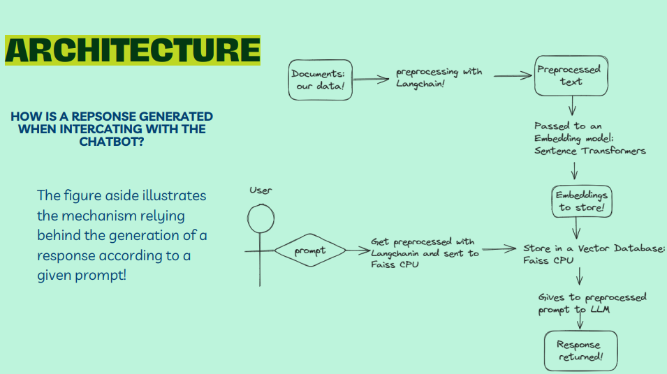

# KnowMD - Leveraging Large Language Models for Informed Medical Decisions

The KnowMD aims to enhance the biomedical data understanding by integrating the large language models for the human way response with the help of the FAISS DB, LiteralAI, openChat, llama2.
## Overview

## Setup Instructions

### Prerequisites
Ensure your system is equipped with the following:
- Python 3.6 or newer
- Essential Python packages (installable via pip):
  - `langchain`
  - `chainlit`
  - `sentence-transformers`
  - `faiss`
  - `PyPDF2` (for loading PDF documents)

### Setting Up Your Environment
1. **Create a Python Virtual Environment** (Recommended):
   - Initialize the environment: 
     ```
     python -m venv venv
     ```
   - Activate the environment:
     - On Unix or MacOS: 
       ```
       source venv/bin/activate
       ```
     - On Windows: 
       ```
       venv\Scripts\activate
       ```

2. **Install Required Packages**:
   - Install all dependencies from the `requirements.txt` file:
     ```
     pip install -r requirements.txt
     ```
3. **Local Model Installation**:
    - TheBloke/openchat-3.5-0106-GGUF and 
    - TheBloke/Llama-2-7B-Chat-GGM
    ```
    def load_llm(model_name):
    try:
        print(f"Loading model: {model_name}")
        if model_name == "TheBloke/openchat-3.5-0106-GGUF":
            lm = CTransformers(
                model=model_name,
                max_tokens=512,
                temperature=0.5,
            )
        elif model_name == "TheBloke/Llama-2-7B-Chat-GGML":
            lm = CTransformers(
                model=model_name,
                model_type="llama",
                max_new_tokens=512,
                temperature=0.5
            )
        else:
            raise ValueError(f"Unsupported model: {model_name}")
        return lm
    except Exception as e:
        print(f"Error loading model {model_name}: {e}")
        raise```

4. **Database Path Setup**

     Configuring DB_FAISS_PATH variable and any other custom configurations in the code.

5. **RAG Bot**
- create data for the vector database
    ```python ingest.py```
- Run the rag chatbot 
```chainlit run model.py```

## Usage
To use the Openchat llm model Chatbot, ensure that the required data sources are available in the specified 'data' directory. This data can be in the file format of pdf, txt, or xlsx. Run the `ingest.py` script first to process the data and create the vector database. Once the database is ready, open Git Bash within your folder, and input/execute the following: `chainlit run model.py -w` to start the chatbot and interact with your files.



